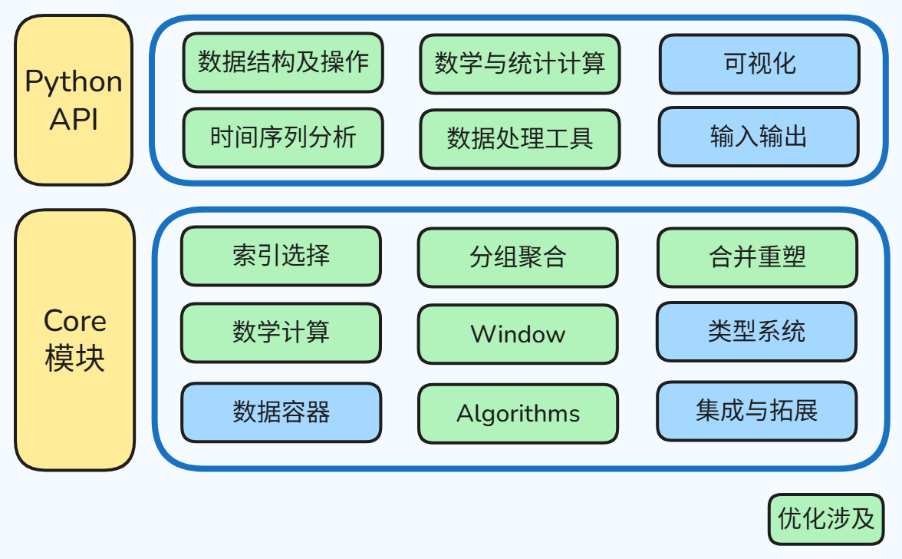
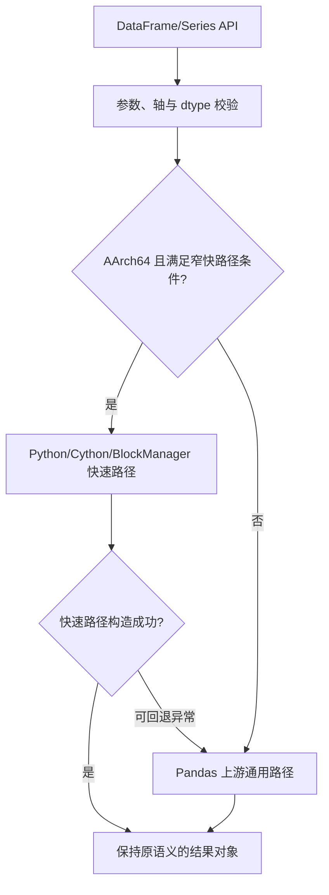
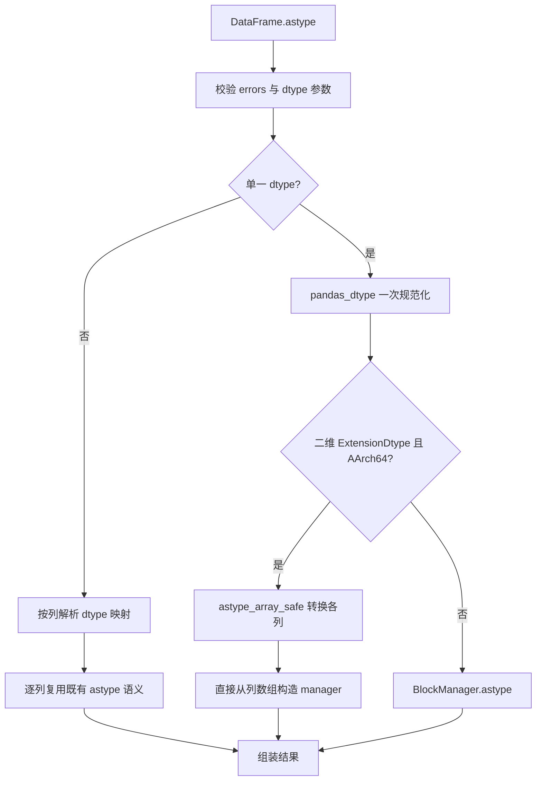
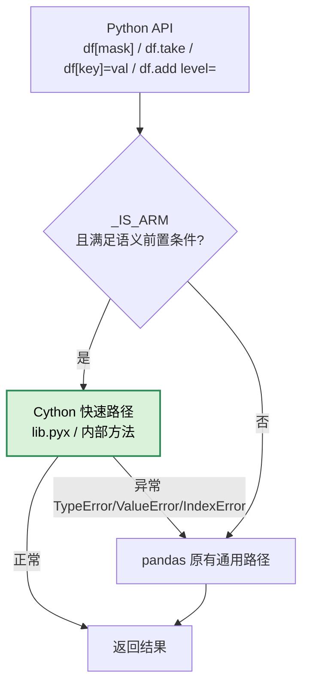
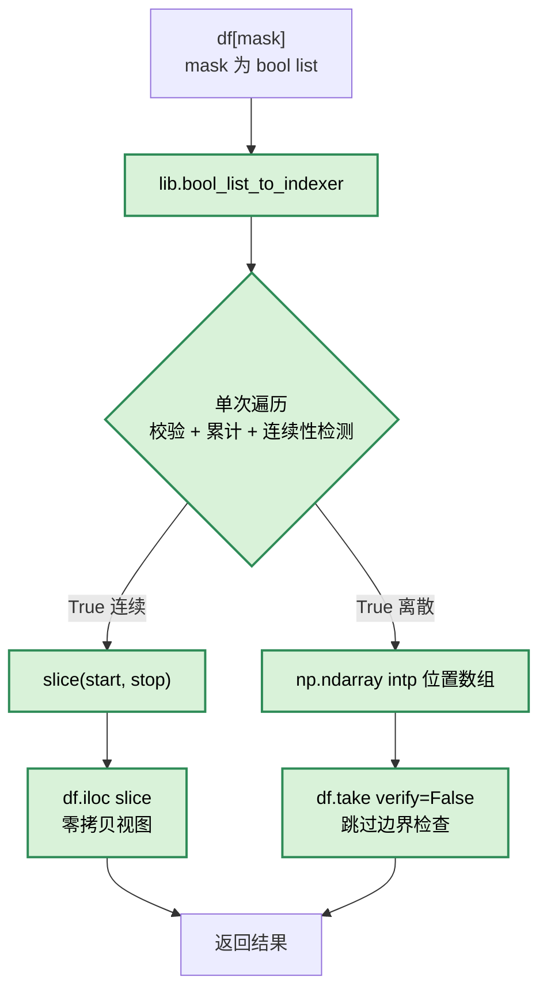
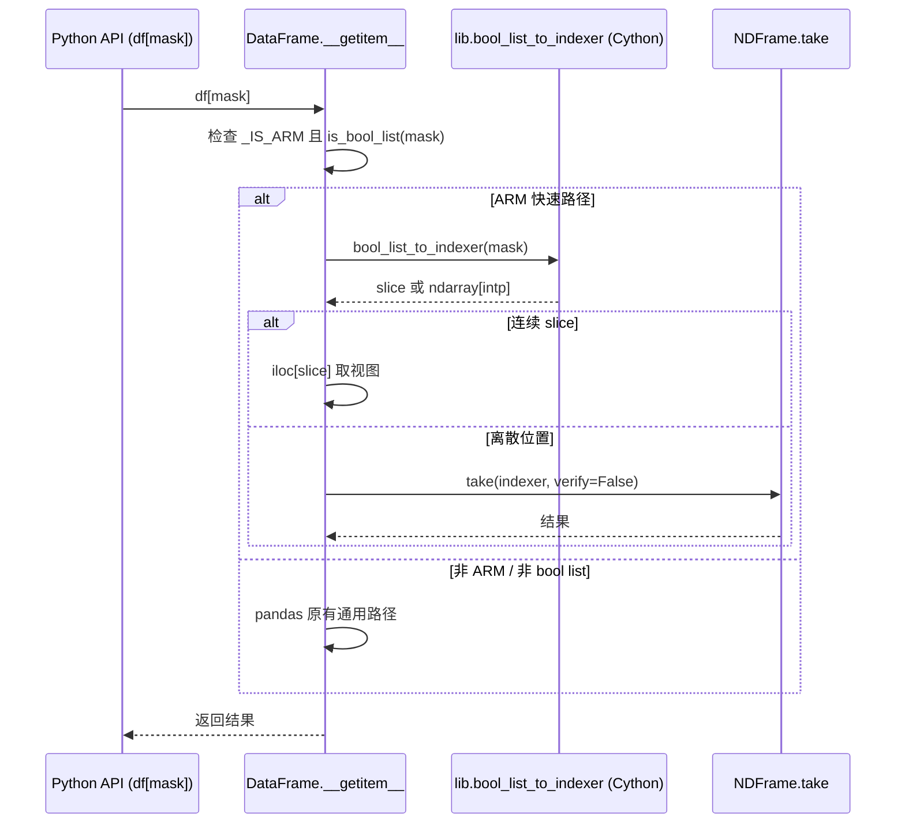
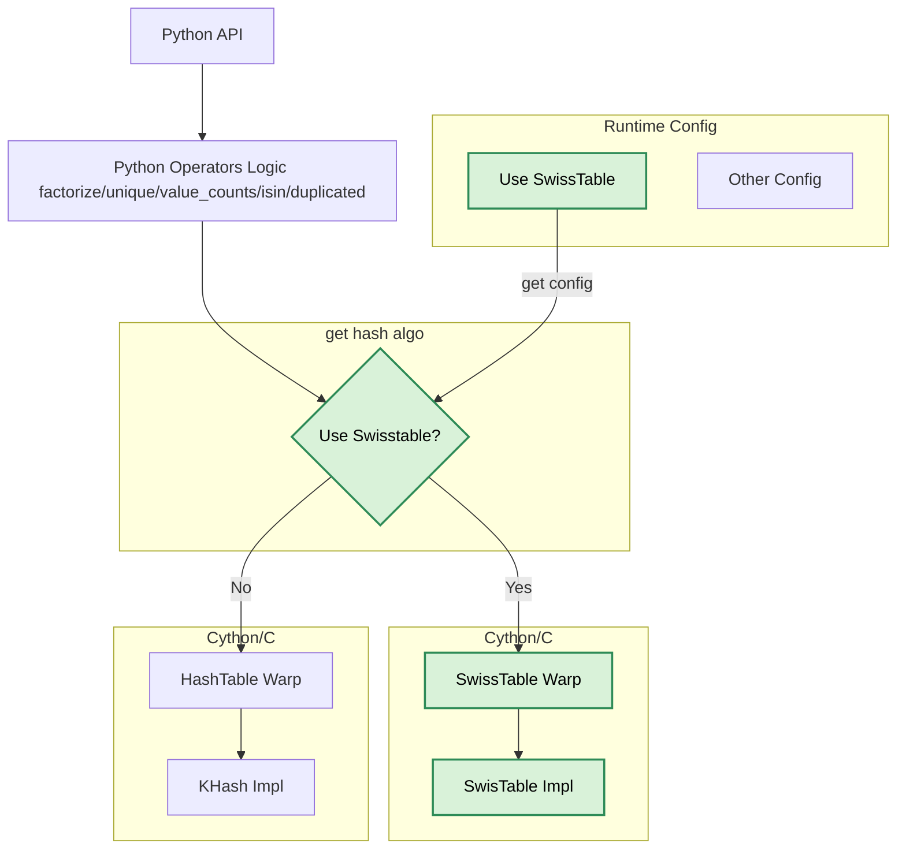
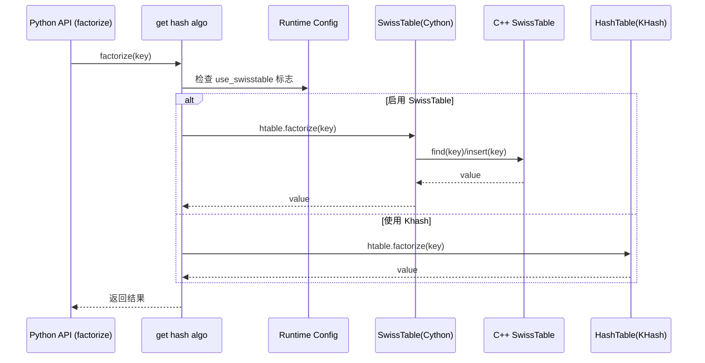

**状态 (Status):** Draft

**作者 (Authors):** @鲲鹏Pandas性能优化团队

**创建日期 (Created):** 2026-07-13

**更新日期 (Updated):** 2026-07-13

**相关 Issue/PR:**  


# 1. 概述

## 1.1 简介

旨在系统性地提升 Pandas 数据处理库在鲲鹏平台（920B/950）上的性能表现。通过算法优化，热点下沉， SIMD 向量化增强、鲲鹏平台亲和性调优等多维度技术手段，在保持 Pandas API 100% 兼容与生态一致性的前提下，实现数据结构与操作、数学与统计计算、时间序列分析、数据处理工具四大核心场景的性能显著提升。
核心价值在于：让 Pandas 用户无需修改任何业务代码，即可在鲲鹏平台上获得更优的数据处理性能，同时将优化成果回馈 Pandas 上游社区，推动 ARM64 生态的整体演进。

## 1.2 动机

Pandas 作为 Python 数据科学生态的核心库之一，其性能上限远未被充分挖掘。当前在鲲鹏平台上面临以下核心痛点：

**算法在鲲鹏上性能表现不佳**：HashTable 等底层核心算法存在较多分支预测和随机访存，大量用例在鲲鹏平台上的性能表现弱于 Zen4，反映出算法对鲲鹏微架构的亲和性不足。

**社区 ARM64 优化覆盖不足**：Pandas 依赖于 NumPy、PyArrow等三方库的向量化优化，目前没有任何直接的 SIMD 代码，虽然有若干 PR 尝试添加 SIMD 支持（如 skew/kurtosis 的 SIMD 计算等），但整体缺乏统一的 SIMD 策略。

**鲲鹏平台特有优化空间待挖掘**：鲲鹏 920B/950 处理器的 NEON 向量单元、SVE 指令扩展等硬件特性尚未在 Pandas 生态中得到充分利用。

**四大场景性能瓶颈突出**：

- 数据结构与操作：DataFrame/Series 构造、.loc/.iloc 索引选择等操作在大数据量下存在明显延迟；
- 数学与统计计算：groupby 聚合、rolling 滑窗在大型 DataFrame 和浮点型数据场景下与友商存在差距；
- 时间序列分析：Datetime 解析与 resample 重采样操作效率有待提升；
- 数据处理工具：合并联接、透视表、字符串操作（.str 方法）等典型数据处理性能偏弱。

**不做此提案的影响**：鲲鹏平台用户将持续面临 Pandas 性能瓶颈，数据处理任务耗时增加，影响 AI 数据预处理、大数据等场景的效率；鲲鹏平台在数据科学领域的竞争力将受到制约；Pandas 社区 ARM64 生态的完善进程将被延缓。

## 1.3 目标

**目标：**

1. **性能目标**：相关性能测试用例在鲲鹏平台上的整体性能提升15%，920B 持平Zen4，950 优于Zen4
2. **兼容性目标**：100% 保持 Pandas 公有 API 兼容性，通过 Pandas 官方测试套件
3. **生态目标**：核心优化以 PR 形式提交 Pandas 上游社区，建立 ARM64 基准测试长期运行机制
4. **可观测性目标**：建立优化场景用例的 ASV 基准测试体系，关键基准组设置 5% 回归阈值

**非目标：**

1.  不修改 Pandas 底层（Array、Block）数据结构及管理
2.  不修改 Pandas 公共 API 接口及功能
3.  不针对 Pandas 现有框架进行改进

---
# 2. 用例分析

本提案覆盖 Pandas 常用的四大 Usecase 场景，各场景的功能点，性能指标及质量要求如下：

### 2.1 数据结构与操作

针对 Pandas 中 DataFrame/Series 的构造、数据类型转换、索引与选择、缺失值处理及算术运算等核心数据结构操作进行深度优化。重点利用鲲鹏硬件更宽的 SVE 向量化能力、更大的缓存和增强的微架构特性，通过减少不必要的数据拷贝、提升标量与数组运算的向量化效率，综合提升数据构建、访问及变换操作的吞吐量。

**功能点**：

- DataFrame/Series 构造（从字典、列表、NumPy 数组等）
- 数据类型转换（`astype`，含可空类型与 PyArrow 类型）
- 索引与选择（`.loc`/`.iloc`，布尔索引等）
- 缺失值处理（`isna`/`dropna`/`fillna`）
- 算术运算（`add`/`sub`/`mul`/`div` 等）

### 2.2 数学与统计计算

针对 Pandas 中广泛使用的分组聚合（groupby）与窗口滚动计算（rolling）进行深度优化。重点利用鲲鹏硬件的大容量缓存、SVE 向量化能力及多核并行特性，通过改进哈希分组算法、优化 Cython 聚合内循环、实现滚动窗口的增量计算以及减少分组间数据重排，显著提升大规模数据下的聚合、变换、累计和滑动窗口统计的吞吐量。

**功能点**：

- `groupby` 聚合（`sum`/`mean`/`max`/`min`/`count`/`std`/`var` 等）
- `groupby` 变换（`transform`）与自定义函数（`apply`）
- 滚动窗口计算（`rolling().mean`/`sum`/`var`/`std` 等内置方法）
- 扩展窗口计算（`expanding`）

### 2.3 时间序列分析

针对 Pandas 时间序列功能中的 Datetime 属性访问、时间偏移量算术、Timedelta 构造以及重采样（resample）操作进行深度优化。重点利用鲲鹏硬件指令级并行和 SVE 向量化能力，减少时间类型转换开销，加速周期性标签生成和重采样分组聚合路径，提升金融、物联网等时间密集型场景的处理效率。

**功能点**：

- `pd.to_datetime()` 字符串解析（含多格式与混合时区）
- `DatetimeIndex` 属性访问（`.year`/`.month`/`.day`/`.hour` 等）
- `DateOffset` 与 `Timedelta` 算术运算
- `resample` 重采样（`D`/`M`/`Q`/`Y` 等频率，含聚合与变换）
- 日期范围生成（`pd.date_range`）

### 2.4 数据处理工具

针对 Pandas 中通用算法类功能（如因子化、唯一值、值计数、成员判断、重复检测、`apply` 等）和字符串处理功能进行深度优化。重点利用优化的哈希算法和并行化能力，减少 Python 函数调用开销，加速哈希表构建与查找，提升字符串操作的直接内存处理效率，为数据清洗和特征工程场景提供更高吞吐量。

**功能点**：

- 因子化（`factorize`）、唯一值（`unique`）与值计数（`value_counts`）
- 成员判断（`isin`）、重复检测（`duplicated`）
- `apply` 逐元素或逐行函数
- 字符串方法（`.str.lower`/`.str.upper`/`.str.contains` 等）

## 2.5 关键性能指标与质量要求

**关键性能指标**：
- 单算子性能提升超过5%才能计算受益，下降超5%视为劣化。
- 相关性能测试用例在鲲鹏平台上的整体性能提升15%，920B 持平Zen4，950 优于 Zen4 15%。
- 单算子用例在 Zen4 上的性能自提升不超过鲲鹏性能自提升的 1/3。

**质量要求**：
- 所有优化必须 100% 保持 Pandas 公有 API 语义兼容，用户的存量代码无需修改即可在优化版本上运行。
- 所有计算结果（含聚合、算术、字符串处理、时间转换等）须与上游 Pandas 在浮点误差容忍范围内完全一致，特殊边界条件（含 NaN、空值、夏令时切换、闰年、多字节字符等）语义须与上游保持严格一致。
- 涉及哈希表的优化须保证结果的确定性与可重现性，并与上游顺序语义保持一致。
- 所有优化代码须通过 Pandas 官方测试套件，核心路径须有单元测试与回归测试覆盖。

---
# 3. 方案设计

## 3.1 总体方案

**Pandas 整体逻辑架构**：


Pandas 采用分层架构设计，上层提供统一的 Python API，向用户屏蔽底层实现细节；下层由核心功能模块组成，实现数据管理、索引访问、计算分析及类型管理等基础能力。整体架构如图所示。

其中，上层 **Python API** 面向用户提供统一的数据分析接口，涵盖数据结构与操作、数学与统计计算、时间序列分析、数据处理工具、可视化等能力，用户通过 DataFrame、Series 等对象完成数据处理流程，无需关注底层实现。

下层 **Core 模块** 是 Pandas 的核心计算逻辑，负责实现数据容器管理、索引选择、数据重塑、分组聚合、窗口计算、数学计算、算法实现以及类型系统等核心能力。

**核心优化逻辑**：

以 Pandas 原生架构为基础，围绕 Python 逻辑层、Cython 层、C/C++ 计算层以及底层 SIMD 指令层进行逐层优化，在保证 Pandas API 完全兼容的前提下，实现整体性能提升。

优化采用"**算法优化 + 代码逻辑优化 + 数据结构优化 + SIMD 向量化**"四类技术协同推进，各层职责如下：

| 优化方向        | 覆盖层次                    | 主要目标                                             |
| ----------- | ----------------------- | ------------------------------------------------ |
| 算法优化        | Python → Cython → C/C++ | 算法鲲鹏亲和化、降低复杂度、减少重复计算、优化执行流程                      |
| 通用代码逻辑优化    | Python → Cython         | Python 热点下沉 Cython，消除 Python 解释器开销，消除冗余逻辑、缓存计算结果 |
| 数据结构优化      | Cython → C/C++          | 提高缓存命中率、降低内存访问成本、减少对象分配                          |
| SIMD 指令集向量化 | C/C++                   | 利用 NEON/SVE 提升数据并行计算能力                           |

整个优化链路遵循"**自上而下识别热点，自下而上释放硬件性能**"的设计思路：

1. **算法层优化**
    - 优化底层哈希表算法 ，新增支持向量化扫描的 SwissTable 实现，减少分支判断；
    - 优化热点算子（如 GroupBy、Merge、Rolling等）算法实现，减少不必要的数据扫描、对象创建和重复计算；
    - 优先采用复杂度优化，而非直接进行底层指令优化。
2. **通用代码逻辑优化**
    - 对 Python 层热点循环、频繁函数调用及对象操作进行识别；
    - Python 热点下沉 Cython，将计算密集型逻辑迁移至 Cython，实现静态类型化和 C-Level 调用；
    - 降低 Python 解释器调度、引用计数和动态类型检查带来的开销。
3. **数据结构优化**
    - 对 SkipList 等核心数据结构进行优化，改善内存布局，提高 Cache Locality；
    - 优化 Cython 循环层级在连续输入场景的数据访问模式，规避迭代器访问开销；
    - 减少 malloc/free 次数，优化对象生命周期，降低 Cache Miss 和内存带宽压力。
4. **SIMD 向量化优化**
    - 针对连续数组计算、扫描、聚合等热点路径，引入 NEON/SVE 向量指令；
    - 结合软件预取（Prefetch）、循环展开（Loop Unrolling）等技术进一步提升流水线利用率；
    - 结合 NumPy 底层算子 NEON/SVE 向量化优化。

## 3.2 技术选型

### 3.2.1 上游社区对接策略选型

当前 Pandas 社区正处于架构转型期（NumPy→PyArrow底层迁移），技术文化保守、API稳定性要求严格、平台特化接受度低，本设计在制定社区对接策略时，调研并对比了以下三种方案：

| 策略方案              | 描述                                                               | 优势                                   | 劣势                                     |
| ----------------- | ---------------------------------------------------------------- | ------------------------------------ | -------------------------------------- |
| **策略A：完全上游优先**    | 所有优化（含 SIMD 指令集、鲲鹏微架构特性）均以 PR 形式提交 Pandas 上游，接受社区完整审查流程          | 长期维护成本最低，与社区演进同步                     | 大量 ARM 特化代码难以被社区接受，PR 可能长期悬置或被拒，拖慢整体进度 |
| **策略B：完全下游自维护**   | 所有优化仅在内部或下游发行版中维护，与上游保持最大距离                                      | 推进速度快，不受社区审查约束                       | 与上游分歧持续扩大，长期合并成本急剧升高，社区生态割裂            |
| **策略C：分层贡献（本方案）** | 根据优化类型分级处理：算法改进与通用逻辑优化积极贡献上游；SIMD 优化优先合入下游并伺机审慎贡献；微架构性能调优参数仅下游维护 | 平衡短期交付与长期生态融合，最大化社区收益，同时满足鲲鹏平台极致性能需求 | 需维护部分下游专属代码，但仍保持与上游主干可同步               |

**选择策略C理由**：

- Pandas 社区对算法改进和通用的 Cython 优化持开放态度，且此类优化跨平台收益明显，是最容易合入上游的贡献类型。
- SIMD 向量化（特别是 ARM NEON/SVE）属于平台增强，社区尚未形成统一的 SIMD 策略框架（Issue #64884 讨论中），当前阶段强行推进上游 PR 成本高、成功率低；但通过 xsimd 等架构无关抽象层，可使部分 SIMD 代码具备跨平台通用性，待社区策略成熟后仍有机会合入。
- 鲲鹏微架构级优化（如缓存预取、特定指令序列）属于深度平台特化，社区接受度低，明确以下游方式维护最为务实，且可通过条件编译隔离影响。

### 3.2.2 优化类别与对接路径映射

基于上述策略，将本次 Pandas 算子优化点划分为四大类别，明确各自的技术路径与社区对接方式：

| 优化类别            | 技术特点                                                            | 社区对接路径            | 合入条件与约束                                                                                                                         |
| --------------- | --------------------------------------------------------------- | ----------------- | ------------------------------------------------------------------------------------------------------------------------------- |
| **算法优化**        | Join / GroupBy / Rolling 算法改进、排序优化、内存访问模式优化、SwissTable 向量化哈希表接入 | **上游优先贡献**        | 不改变 API 行为，需通过 ASV benchmark 验证性能不劣化；代码需符合社区编码标准                                                                                |
| **通用代码逻辑优化**    | 冗余计算消减、热点路径下沉Cython 、类型推断优化                                     | **上游优先贡献**        | 同上，跨平台兼容，维护成本低，社区接受度高                                                                                                           |
| **SIMD 指令集向量化** | 基于 xsimd 抽象层的 ARM NEON/SVE 向量化、手写 intrinsic 热点                  | **优先合入下游，审慎贡献上游** | 对于通过 xsimd 实现跨架构统一的向量化代码，待社区 SIMD 策略（[#64884](https://github.com/pandas-dev/pandas/issues/64884)）定稿后积极推进上游；手写 intrinsic 部分仅下游维护 |
| **鲲鹏微架构优化**     | 结合鲲鹏调优的循环展开、缓存预取、数据分块参数定制                                       | **下游社区贡献**        | 仅鲲鹏平台生效，通过条件编译隔离，不影响其他架构，不作为 Pandas 上游 PR 提交                                                                                    |

### 3.2.3 SIMD 技术栈选型

针对向量化优化，结合社区技术导向后确定技术栈：

| 方案                        | 优势                                                                                            | 劣势                        | 结论                 |
| ------------------------- | --------------------------------------------------------------------------------------------- | ------------------------- | ------------------ |
| **手写 NEON/SVE intrinsic** | 性能最优，完全控制指令选择                                                                                 | 维护成本极高，需为每个指令集独立编码，社区接受度低 | 极致调优的放下游社区维护       |
| **xsimd 向量化抽象库**          | 架构无关，一套代码编译多平台；Pandas 最新主线已经引入作为依赖([#65471](https://github.com/pandas-dev/pandas/pull/65471)) | Header-only 库，编译期开销略大     | **主力方案**，覆盖多数向量化场景 |
| **Highway 向量化抽象库**        | 架构无关，NumPy 社区主推                                                                               | 社区未接纳                     | 不引入                |

**选型依据**：xsimd 兼顾性能与可维护性，且能够平滑对接社区未来的 SIMD 策略方向（参考[#65801](https://github.com/pandas-dev/pandas/pull/65801)）。手写 intrinsic 用于保留鲲鹏极致性能实现在下游社区。

## 3.3 功能与性能设计

### 3.3.1 数据结构及其操作

#### 3.3.1.1 功能概述

Pandas 数据结构操作由公开 API、数组/ExtensionArray、Block/BlockManager 和 Cython 内核共同完成。其主要性能成本并不只来自元素计算，还包括输入规范化、标签对齐、dtype 分发、临时对象创建、掩码生成和数据块重组。

本设计将五类功能按调用阶段划分如下：

| 功能   | 主要 API                                     | 核心语义                   | 优化重点                            |
| ---- | ------------------------------------------ | ---------------------- | ------------------------------- |
| 构造   | `DataFrame(...)`、`Series(...)`、`from_dict` | 轴推断、dtype 保持、复制与共享     | 可信数组直建 manager、减少包装和复制          |
| 类型转换 | `DataFrame.astype`、`Series.astype`         | dtype 校验、逐列转换、错误处理     | dtype 一次规范化、ExtensionArray 直接组装 |
| 索引选择 | `.loc`、`.iloc`、`[]`、`take`、`where`         | 标签/位置解析、维度保持、对齐        | 布尔索引遍历融合、窄场景快速索引器               |
| 缺失值  | `isna`、`dropna`、`fillna`                   | NA 判定、阈值、列映射、原位语义      | Cython 有效性归约、按列批量填充             |
| 算术   | `add`、`sub`、`mul`、`div` 及运算符               | 标签对齐、广播、dtype 提升、NA 传播 | 对齐窄快路径、融合数值内核、减少结果包装            |

#### 3.3.1.2 实现思路

##### 1. 分层减少中间对象

构造和转换操作原路径可能经历“数组 → Series → concat → BlockManager”的多次包装。对于已经完成 dtype 转换、长度一致且轴已确定的列数组，直接调用列数组 manager 构造入口，保留引用信息并一次生成结果对象。对于算术结果，直接从结果 manager 构造 Series，避免再次抽取数组并执行通用构造校验。

##### 2. 将重复遍历融合为单次处理

- 布尔列表索引将类型校验、True 位置收集和连续区间识别合并为一次遍历；
- `dropna` 对连续 float64 数据块一次计算各列有效值数量，避免为每列生成完整临时布尔数组；
- 等长连续 `int64` 真除法在同一 Cython 循环中完成整数到浮点转换和除法；
- nullable 数组无缺失值时不再传递空掩码，避免下游无效分支。

##### 3. 缩窄快速路径的适用范围

每条优化仅在能够证明与通用路径等价时启用。例如：

- 直接 manager 构造要求列长度、轴和 dtype 已由上层校验；
- `astype` 快速组装仅处理逐列转换完成的二维 ExtensionDtype 场景；
- `int64` 真除法要求左右操作数均为一维、等长、C 连续的 `int64` ndarray；
- MultiIndex level 算术要求列完全一致、右侧索引唯一并覆盖指定 level；
- dict `fillna` 批处理要求每个 block 仅对应一列、列唯一且填充值能由原 dtype 安全容纳。

不满足任一条件时回退上游 Pandas 原路径。

#### 3.3.1.3 实现设计

##### 3.3.1.3.1 总体架构



快速路径只优化内部执行方式，不新增公开 API，不改变函数签名。

##### 3.3.1.3.2 DataFrame/Series 构造设计

**调用链路**：

```text
DataFrame/Series 构造入口
    → 输入分类与轴校验
    → sanitize_array / arrays_to_mgr
    → Block/BlockManager
    → DataFrame/Series
```

**优化设计**：

1. 对已经过校验的列数组使用可信构造标记，跳过重复的长度、维度和 dtype 检查。
2. 已知列数组与 `index`、`columns` 一致时，直接调用 `create_block_manager_from_column_arrays`，避免逐列包装为 Series 后再 concat。
3. AArch64 下浅拷贝 manager 时直接复制 block 元数据并共享底层值；实际写入仍由 Copy-on-Write 触发复制。
4. 从算术结果生成 Series 时，直接复用结果 manager 和轴信息，不重新走通用 Series 构造流程。
5. NumPy 数组构造必须保持原数组 dtype；`NumpyExtensionArray` 仅在专用构造路径中按明确条件解包，不能改变 JSON、datetime、period 或其他 ExtensionArray 的原有分发。

**回退条件**：输入为生成器、嵌套不规则数据、轴长度不一致、需要复杂 dtype 推断或 ExtensionArray 具有专用构造语义时，执行原构造路径。

##### 3.3.1.3.3 `astype` 类型转换设计

**功能范围**：

- NumPy dtype，如 `int64`、`float64`、`bool`、`object`；
- Pandas 可空 dtype，如 `Int64`、`Float64`、`boolean`、`string`；
- PyArrow dtype，如 `int64[pyarrow]`、`string[pyarrow]`；
- 单一 dtype 和列到 dtype 的映射。

**处理流程**：



**关键约束**：

1. dtype 只规范化一次，避免 DataFrame 层和 manager 层重复调用 `pandas_dtype`。
2. 每列仍使用 `astype_array_safe`，因此 `errors="raise"/"ignore"`、溢出、非法字符串转换等行为不变。
3. 可空类型和 PyArrow 类型保留各自 ExtensionArray，不将其隐式转为 NumPy object 数组。
4. 直接组装结果时同步传递 block 引用；只有 `astype_is_view` 判定可共享时才保留引用关系。
5. dtype 类而非实例等非法输入继续抛出与上游一致的 `TypeError`。

##### 3.3.1.3.4 索引与选择设计

**布尔索引**：

1. `DataFrame[bool_list]` 在 AArch64 下调用 Cython 索引器，将 bool 校验、位置提取和连续性识别融合为单次遍历。
2. True 区间连续时返回 slice，复用 `.iloc` 切片路径；离散时返回 `intp` 位置数组并调用 `take`。
3. 布尔 ndarray/Series 在长度、dtype、索引对齐满足要求时使用专用 mask/indexer；否则执行 `is_bool_indexer` 和标准对齐。

**`.loc`/`.iloc` 与 `take`**：

- `.loc` 继续负责标签解析、缺失标签报错和布尔 Series 对齐；
- `.iloc` 继续负责整数边界、负索引和切片规则；
- 内部已校验的 indexer 可通过 `take(verify=False)` 跳过重复边界检查；公开调用不能绕过校验。

**MultiIndex level 算术选择**：

当 `df.add(other, level=..., axis="columns")` 满足右侧索引唯一且精确覆盖指定 level 时，使用 `codes[level] + get_indexer` 构造行索引器，绕过通用 `_join_level`。未使用的 level、重复标签或不完整覆盖均回退原 join 路径。

历史迭代中还验证了以 reindex 或 NumPy fancy indexing 替换现有 take 路径，但大数组复制和填充成本抵消了收益，因此未采用。

**赋值与条件选择**：

- 标量或多列 setitem 在 dtype 可安全容纳且列定位明确时批量更新 manager，避免逐列重建；
- nullable/PyArrow 数组的标量 `where`/`putmask` 直接操作数据和掩码；只接受与原 dtype 兼容的标量；
- 条件数组形状不匹配、只读数组写入或非法值仍抛出既有异常。

##### 3.3.1.3.5 缺失值处理设计

**`isna`**：

`isna` 继续作为统一缺失值判定入口，分别处理 NumPy NaN/NaT、`pd.NA`、对象数组和 ExtensionArray 掩码。设计不改变缺失值定义；其输出掩码供 `dropna`、`fillna` 和 `where` 复用。

**`dropna`**：

1. 对连续 float64 block 使用 Cython 有效性归约，一次遍历计算各列非 NaN 数量。
2. 根据 `how`、`thresh` 和 `subset` 生成保留行/列索引器。
3. mixed block、非连续数组、ExtensionArray 或不满足窄条件时回退标准 `notna(...).all/any/sum` 路径。
4. 空 DataFrame、全 NA、无 NA、重复列名和 `subset` 异常保持上游行为。

混合 block 的 Count/Dropna 统一归约方案未带来新的 5% 以上收益，且 Count 存在回退，因此只保留纯浮点 block 的窄优化。

**`fillna`**：

1. 标量填充继续按 block/ExtensionArray 的 dtype 校验执行。
2. 字典或 Series 映射填充在列唯一、单列 block 且值可安全容纳时，由 BlockManager 一次批量处理，减少逐列对象创建和 manager 重建。
3. `inplace=True` 仅在引用和 Copy-on-Write 条件允许时走安全批处理；存在共享引用时执行必要复制。
4. nullable 和 PyArrow 数组使用自身掩码写入路径，保证 `pd.NA`、`np.nan` 与 Arrow null 语义不混淆。
5. `limit`、非法填充值、长度不匹配及只读数组等情况执行原校验或回退。

原生 float64 `where` 内核受内存布局检查限制未获得可测收益，未纳入最终实现；最终仅保留 nullable 和 PyArrow 扩展数组的标量快速路径。

##### 3.3.1.3.6 算术运算设计

**通用流程**：

```text
Series/DataFrame 算术 API
    → 操作数提取与标量准备
    → 标签对齐/广播
    → dtype 与缺失值分发
    → NumPy/numexpr/Cython/ExtensionArray 运算
    → 从结果 manager 构造返回对象
```

**等长 `int64` 真除法**：

1. 在广播检查之后识别左右均为一维、等长、C 连续 `int64` ndarray 的场景。
2. 调用 Cython `int64_true_divide`，在单循环中读取整数、转换为 float64 并完成除法。
3. 除数为零时保持 NumPy 的 `inf`/`nan` 与 warning 行为。
4. 形状不一致必须先由广播规则处理或抛出原 `ValueError`，不能因快速内核而接受非法广播。

**其他算术操作**：

- `add`/`sub`/`mul` 和不满足条件的 `div` 继续使用 blockwise、NumPy、numexpr 或 ExtensionArray 原路径；
- 标量运算保持广播，不显式扩张为同形数组；
- nullable、PyArrow、datetime/timedelta 等类型继续由对应 ExtensionArray 或专用算术分发处理；
- 结果 Series 直接从结果 manager 构造，保留 name、index 和 dtype。

### 3.3.2 索引与选择
#### 3.3.2.1 实现思路

Pandas 索引选择链路在鲲鹏/AArch64 上存在三类可观测开销：
① Python 层校验链冗余——以 `DataFrame[mask]` 为例，原路径需依次执行 `is_bool_list` 校验、转 bool ndarray、`nonzero` 三次遍历；
② 通用 join 路径过宽——`MultiIndex._join_level` 需处理缺失标签、非唯一 index 等复杂对齐场景，但在列一致且右侧 index 唯一的常见场景下纯属额外开销；
③ 哈希表后端吞吐不足——`isin`/`factorize` 依赖的旧哈希表在数值路径上探测与分配开销较高。GitHub 上游 issue [#33924](https://github.com/pandas-dev/pandas/issues/33924)、[#30349](https://github.com/pandas-dev/pandas/issues/30349) 指出布尔索引器的多次遍历问题，[#14775](https://github.com/pandas-dev/pandas/issues/14775)、[#15417](https://github.com/pandas-dev/pandas/issues/15417) 指出 MultiIndex level join 的性能热点。

索引选择的瓶颈在于调度开销与冗余遍历，而非计算密集，故优化主线为"遍历融合 + 跳过非必要校验 + 批量调度 + 窄快路径 + 后端替换"，与计算密集型算子的 SIMD 优化互补。所有快速路径通过 `_IS_ARM`（`pandas/compat/_arch.py`）或更窄的语义条件门控，非门控场景行为与上游 pandas 完全一致。涉及的优化项汇总如下：

| 操作  | 作用  | 主要优化点 | 适用平台 |
| --- | --- | ----- | ---- |
| 布尔列表索引 | `DataFrame[mask]` 选行 | 三次遍历融合为一次、连续 True 返回 slice、`take(verify=False)` 跳过边界检查 | ARM |
| 布尔 ndarray/Series 索引 | Index/Series 布尔选值 | `compress`/`fast_bool_index_objarray`/`fast_bool_mask_indexer` 直通，跳过 `is_bool_indexer` | ARM |
| `NDFrame.take`/`Block.take` | 按位置数组取值 | 新增 `verify` 参数跳过校验；无 fill 用 `np.ndarray.take` 替代 `algos.take_nd` | ARM&x86 |
| `setitem`（标量/多列） | `df[key]=scalar` | 直接 `_set_item` 跳过类型检查链；`_batch_setitem`+`iset_batch` 避免级联重建 | ARM |
| MultiIndex level 对齐 | `df.add(..., level=)` | `codes[level]`+`get_indexer` 构造行索引器，绕过 `_join_level` | ARM&x86 |
| `isin`/`factorize` | 成员判定/唯一化编码 | SwissTable 后端替换旧哈希表 | ARM&x86 |

#### 3.3.2.2 实现设计

整体采用"ARM 门控 + 语义前置条件 + Cython 快速路径 + 异常回退"的四段式设计，为高频窄场景增加快速路径并替换哈希后端，不做单点算子融合。

**（1）总体架构**

所有快速路径统一通过 `_IS_ARM` 门控，满足前置条件时进入 Cython 快速路径，否则回退 pandas 原有通用路径：



**（2）布尔索引快速路径**

布尔列表索引是收益最大的子项。新增 Cython 函数 `bool_list_to_indexer`（`pandas/_libs/lib.pyx`），将原路径的三次遍历（`is_bool_list` 校验 → 转 bool ndarray → `nonzero`）融合为单次遍历，遍历时同时完成 bool 校验、位置累计与连续性检测。若 True 值连续，返回 `slice(start, stop)`，下游用 `iloc` 取视图（零拷贝）；若离散，返回位置数组，下游用 `take(verify=False)` 跳过边界检查。



运行时序：



**（3）setitem 批量写入**

setitem 的瓶颈是 BlockManager 重建次数而非元素级运算。单列标量赋值（`df[int_key]=scalar`）在确认类型简单后直接调用 `_set_item`，跳过类型检查链。多列标量赋值（`df[list_of_cols]=scalar`）新增 `_batch_setitem`，底层调用 `BlockManager.iset_batch`：先批量 split block，再统一添加新 block，将多次 `iset` 导致的级联重建收敛为一次。类型提升仍走 pandas 原有 cast 路径。

**（4）MultiIndex level 对齐**

为 DataFrame-vs-DataFrame flex arithmetic（`df.add(..., level=, axis="columns")`）增加窄快路径。当满足指定 level、无 fill_value、左侧 index 为 MultiIndex、左右 columns 完全一致、右侧 index 唯一且精确覆盖左侧指定 level 的全部 labels 时，直接用 `self.index.codes[level]` 与 `other.index.get_indexer(self.index.levels[level])` 构造右侧行索引器，绕过通用 `MultiIndex._join_level` 哈希 join。构造完索引器后仍复用 `_reindex_with_indexers` 走现有 BlockManager take 与 blockwise arithmetic 路径。该项为平台无关优化，Kunpeng920b 与 Zen4 均受益。不满足条件或构造阶段抛出 `IndexError/KeyError/TypeError/ValueError` 时自动回退原通用对齐路径。

**（5）isin/factorize SwissTable 后端**

`isin`/`factorize` 的数值路径路由到 SwissTable 后端（`pandas/_libs/swisstable.pyx` + `swisstable_class.hpp`），替代旧哈希表实现。SwissTable 采用开放寻址 + 组内 SIMD 探测，提升重复/非唯一数据的探测吞吐。object 与不支持的扩展 dtype 保留原路径，通过运行时配置门控启用。SwissTable 的详细设计见 3.3.7 通用函数章节。

**（6）统一快速路径模板**

所有快速路径遵循统一结构：ARM 门控 → 语义前置条件判定 → Cython 快速路径 → 异常回退。异常捕获范围严格收窄到快路径构造阶段（`TypeError/ValueError/IndexError`），不吞后续算术/IO 异常，保证非门控场景与上游 pandas 语义完全一致。

### 3.3.3 分组聚合与变换
#### 3.3.3.1 功能概述

分组聚合与变换（GroupBy Aggregation & Transformation）是 Pandas 中最核心的数据分析能力之一，广泛应用于统计分析、报表生成、时间序列处理和特征工程等场景。该模块负责根据一个或多个分组键对数据进行分桶，并在每个分组上执行聚合、变换、过滤和累计等操作。
#### 3.3.3.2 实现思路

- **高性能分组构建**：针对高基数和大规模数据场景，优化哈希分组与标签生成。利用 SwissTable 替代原有 khash 实现，通过 SIMD 批量探测元数据，减少哈希冲突导致的分支预测惩罚，加速分组标签的生成。
    
- **内置聚合加速**：对 `sum`、`mean`、`min`、`max`、`count`、`prod`、`std`、`var` 等 Cython 聚合路径进行向量化和并行化。核心思想是将聚合循环重构为多路累加器模式以消除循环携带依赖，利用鲲鹏 NEON/SVE 向量加载与归约指令实现批量数据处理，对非连续内存布局的数据采用分块策略提升缓存利用率。
    
- **变换与累计优化**：对于 `transform`、`cumsum`、`cumcount` 等需要保持原长度输出的操作，通过复用已生成的分组标签避免重复哈希计算；并压缩中间 `ndarray` 的创建与拷贝次数，将结果直接写入预分配缓冲区。
#### 3.3.3.3 实现设计

**（1）分组构建优化**

Pandas 原有的 khash 在高负载因子场景下存在探测链较长、分支预测失败率高的问题，导致鲲鹏处理器指令流水线利用率下降。分组构建使用的因子化（factorize）操作是整个 GroupBy 流程的入口，其性能直接影响后续所有阶段。
分组构建使用的因子化（factorize）基于 SwissTable 的 SIMD 批量匹配机制（详见3.3.7章），减少分支预测与跳转。
优化前及优化后的因子和流程对比如下：
```
       优化前                                优化后
──────────────────────────────────────────────────────────────────────────────
groupby(key)                             groupby(key)
      │                                        │
      ▼                                        ▼
factorize(key)                           factorize(key)
      │                                        │
      ▼                                        ▼
HashTable.Factorize                    get hash algo
      │                                        │
      ▼                                        ▼
   groupid                            SwissTable.Factorize
      │                                        │
      ▼                                        ▼
 groupindex                               groupid
                                               │
                                               ▼
                                          groupindex
```

**（2）聚合执行优化**

对 Pandas 底层内置聚合函数采用 Cython + C 向量化归约内核：

- **循环展开与多路累加器**：将 `for` 循环改造为 4 路或 8 路累加器（Multiple Accumulators）独立运行，各自维护局部求和、计数或统计量，并在循环结束后合并。这种结构打破了单累加器带来的循环携带依赖，允许鲲鹏处理器的乱序执行引擎充分并行多个无依赖的加法运算。
```c
    # 从全局数组中加载各分组的当前状态到4条累加路
    for j in range(4):
        lane_counts[j] = counts[labs[j]]
        lane_nobs[j] = nobs[labs[j], 0]
        lane_sums[j] = sumx[labs[j], 0]
        lane_compensations[j] = compensation[labs[j], 0]
    # 4路交错累加，消除分组间依赖
    for i in range(run_length):
        for j in range(4):
            lane_counts[j] += 1
            val = values[starts[j] + i, 0]
            # NaN 处理：val != val 为 True 时跳过
            if val == val:
                lane_nobs[j] += 1
                # Kahan 补偿求和：y 为补偿后的增量
                y = val - lane_compensations[j]
                t = lane_sums[j] + y
                lane_compensations[j] = t - lane_sums[j] - y
                # 避免非有限补偿量导致精度恶化
                if not isfinite(lane_compensations[j]):
                    lane_compensations[j] = 0
                lane_sums[j] = t
```

- **对连续数据使用 SVE 向量加载与归约**：当分组标签对应的值在内存中连续分布（即同一分组的数据聚集出现），使用 SVE 的 `svld1` 指令向量加载多个元素，配合 `svadd`（浮点加法）和 `svaddv`（向量内归约加法）完成分组内的一次性归约。
```c
if (continguous) {
	for each group {
	    svfloat64_t vacc = svdup_f64(0);
	    for (i = begin; i < end; i += svcntd()) {
	        pg = svwhilelt(i, end);
	        vec = svld1(pg, values + i);
	        vacc = svadd_f64_m(pg, vacc, vec);
	    }
	    group_sum = svaddv(pg_all, vacc);
	}
}
```

- **对非连续数据采用分块策略**：当分组数据过大时，先将原始数据按缓存友好的大小（如 L1 缓存可容纳的块）进行切分，在每个块内直接索引累加局部聚合结果，然后再对跨块的局部结果进行合并（两级归约），提高缓存局部性。
```c
#def GROUPBY_BLOCK_SIZE  // 单次处理的数据块大小，控制工作集尽可能驻留于 L1 Cache。
#def GROUPBY_BLOCK_THRESHOLD  // 数据规模达到阈值后启用 Block 模式，避免小数据集因额外循环产生额外开销。

if (N > GROUPBY_BLOCK_THRESHOLD) {
    with nogil:
        for (block = 0; block < N; block += GROUPBY_BLOCK_SIZE) {
            end = min(block + GROUPBY_BLOCK_SIZE, N);
            for (i = block; i < end; i++) {
                lab = labels[i];
                if (lab < 0)
                    continue;
                ...
                accum[lab] += value;
                ...
            }
        }
    return;
}
```

**（3）变换与累计优化**

对于 `transform`、`cumsum`、`cumcount` 等需要保持原长度输出的操作：

- **复用分组标签**：在分组构建阶段生成的标签数组被缓存，变换和累计操作直接使用，避免重复执行因子化或哈希查找，节省计算量。
    
- **减少中间拷贝**：结果数组预先分配为与输入等长的缓冲区，直接写入而不创建中间 `ndarray`；对于 `transform`，聚合结果根据标签数组反向填充，避免创建临时分组列表。

### 3.3.4 窗口与滚动计算
#### 3.3.4.1 功能概述

pandas 的窗口与滚动计算为 Series 和 DataFrame 提供在滑动窗口上的统计聚合能力，是时序分析、信号处理、金融指标计算的核心原语。主要功能范围包括：
- **基础窗口统计聚合**：mean、sum、std、var、min、max、median、quantile、nunique、first、last 等。
- **自定义应用**：rolling.apply，支持用户传入任意函数，可选择 raw=True（接收 ndarray）或 raw=False（接收 Series），并提供 engine="cython" 与 engine="numba" 两条执行路径。
- **分组滚动**：groupby(...).rolling(...)，按分组键切分数据后在每个分组内独立滚动，结果带分组键与原索引构成的 MultiIndex。

#### 3.3.4.2 实现思路

- **Skiplist 数据结构优化**：针对 `rolling_median`、`rolling_quantile`、`rolling_rank` 等操作的核心数据结构——Skiplist（跳表）进行优化。通过将节点内存布局从 3 次 malloc 重构为单次分配，消除内存碎片并提升缓存局部性；引入 LIKELY/UNLIKELY 分支提示宏优化分支预测；插入软件预取指令（PRFM）掩盖链表遍历的内存延迟。
    
- **增量计算消除窗口冗余**：对固定窗口的统计量（`mean`、`sum`）采用增量更新算法，窗口每次滑动仅减去离开元素并加入进入元素，维护累加和、平方和等中间状态。对 `std`/`var` 等采用数值稳定的 Welford 增量算法，在保证精度的同时实现 O(1) 滑动更新。
    
- **滚动应用分层执行**：对 `rolling.apply` 优先尝试转换为 Cython 内循环，其次通过函数指针回调减少 Python 调用。
#### 3.3.4.3 实现设计

**（1）Skiplist 数据结构优化**

Skiplist 是 `rolling_median`、`rolling_quantile` 和 `rolling_rank` 的核心数据结构，其性能直接决定窗口排序类操作的吞吐量。

**① 单次分配节点布局（1-malloc 设计）**

原始实现每个节点需要 3 次堆分配（`node_t` 本体 + `next[]` 数组 + `width[]` 数组），结构如左图。优化后合并为单次分配，如图：

```
        原始布局(3-malloc)                          优化后布局(1-malloc)
┌──────────────────────┐              ┌──────────────────────┐  ← mem (单次 malloc)
│ node_t **next ───────┼──→ 堆块A      │ double value         │
│ int *width ──────────┼──→ 堆块B      │ int is_nil           │
│ double value         │              │ int levels           │
│ int is_nil           │              │ int ref_count        │
│ int levels           │              │ int _pad ◄──对齐填充  │
│ int ref_count        │              │ node_t **next ────┐  │
└──────────────────────┘              │ int *width ──────┐│  │
      3次 malloc/free                 ├──────────────────┤│  │
      3处不连续内存                    │ next[0] ◄────────┘│  │
      遍历产生3次 cache miss           │ next[1]           │  │
                                      │ ...               │  │
                                      ├───────────────────┤  │
                                      │ width[0] ◄────────┘  │
                                      │ width[1]             │
                                      │ ...                  │
                                      └──────────────────────┘
                                          1次 malloc/free
                                          连续内存，同一 cache line
                                          遍历 cache miss 大幅减少
```

实现方式：一次 `malloc(sizeof(node_t) + levels * sizeof(node_t*) + levels * sizeof(int))`，将 `next` 和 `width` 指针指向同一块内存内偏移位置。

**② 分支提示宏（LIKELY / UNLIKELY）**

在遍历循环的关键判断点加入分支预测提示，引导编译器优化流水线：

```c
// 遍历时层级递减为常见路径
if (SL_LIKELY(level > 0)) {
    SL_PREFETCH_R(node->next[level - 1]);
}
// 越界访问、分配失败、值不存在等为罕见路径
if (SL_UNLIKELY(i < 0 || i >= skp->size)) return NAN;
if (SL_UNLIKELY(!newnode)) return -1;
if (SL_UNLIKELY(value != chain[0]->next[0]->value)) return -1;
```

**③ 软件预取（Software Prefetch）**

在跳表遍历的 while 循环中，利用鲲鹏 `PRFM` 指令提前加载后续节点：

```c
// 遍历循环内预取下一个节点
next_at_level = node->next[level];
PREFETCH_R(next_at_level);  // 预取当前层下一个节点
while (...) {
    node = next_at_level;
    next_at_level = node->next[level];
    PREFETCH_R(next_at_level);  // 掩盖内存延迟
}
```

**（2）固定窗口统计的增量计算优化**

对于 `rolling.mean()` 和 `rolling.sum()`，采用增量更新算法，窗口每次滑动仅处理移除和新加入的两个元素，减少重复计算：

```text
优化前（全量计算）                        优化后（增量更新）
每次滑动遍历全窗口 O(k)                  每次滑动 O(1)
────────────────────────────────────────────────────────
rolling.mean()                       rolling.mean()
      │                                    │
      ▼                                    ▼
for each window:                     初始化: 汇总首窗口
  sum = 0                             sum, count
  for i in window:                           │
    sum += data[i]                   每次滑动:
  result = sum / window              sum -= data[左移除]
      │                              sum += data[右加入]
      ▼                              result = sum / count
  output result                             │
                                            ▼
                                       output result
```

对于 `std`/`var`，采用 Welford 增量算法维护均值和 M2 统计量，窗口滑动时增量更新，保证数值稳定性。

 **（3）Rolling Apply 执行路径优化**

针对 `rolling.apply(func)`，根据用户传入函数的类型进行识别，对于 Pandas 或 NumPy 已支持的内置聚合函数（如 `sum`、`mean`、`min`、`max`、`count`、`std`、`var` 等），直接映射至底层 Cython/C 优化内核执行，减少 Python 解释器参与和 Python/C 边界切换开销。

```
rolling.apply(builtin-sum/np.sum)
        │
        ▼
Builtin Function Detect
        │
        ▼
Rolling Cython Kernel
        │
        ▼
numpy SIMD / Cython Incremental Update
```

### 3.3.5 时间序列解析
#### 3.3.5.1 功能概述

Pandas 时间序列模块用于表示、解析、转换和计算日期时间数据，主要包括 `pd.to_datetime()`、`DatetimeIndex`、`TimedeltaIndex`、`Series.dt`、时间单位转换、时区处理和时间偏移量运算等功能。

时间序列在 Pandas 内部主要使用 int64 保存数值，并由 dtype 记录 datetime 或 timedelta 的时间单位。字符串等外部数据需要先转换为该内部表示；字段访问、时区转换和时间算术则基于底层 int64 数据完成。该模块需要保证 NaT 传播、溢出检测、时区、DST、闰年、月底和异常行为与 Pandas 语义一致。

#### 3.3.5.2 实现思路

时间序列处理的主要性能开销集中在格式解析、dtype 分发、逐元素日期结构转换、通用迭代器访问和时区信息重复初始化等环节。整体采用“规则输入走批量快路径、复杂输入保留通用路径”的优化思路。

1. **优化时间访问器 dtype 分发**

   `Series.dt` 需要依次识别 Arrow、NumPy datetime64、时区 datetime、timedelta64 和 Period 等类型。通过缓存 `data.dtype`，并使用 `dtype.kind` 先区分 datetime 与 timedelta，减少重复属性读取和无关类型判断。

2. **优化连续 datetime/timedelta 数组算术**

   对一维、等长、连续的 datetime64/timedelta64 数组，使用裸指针 C 循环替代 `PyArray_MultiIter`，在 no-GIL 区域完成 NaT 判断和溢出安全加法。广播、非连续和多维输入保留通用迭代器路径。

3. **设计固定格式时间字符串批量解析**

   对显式指定格式、输入格式统一且不包含混合时区的数据，循环外解析格式字符串，循环内直接提取年月日时分秒字段并生成 int64 时间戳，减少逐元素格式推断、正则处理和 Python 对象构造。

4. **设计 datetime 字段批量提取**

   对连续 datetime64 数组，一次遍历批量生成 year、month、day、hour、minute、second 等字段。根据目标字段只计算必要的日期信息，避免为每个元素构造完整 `Timestamp` 对象。

5. **优化时间单位转换**

   对秒、毫秒、微秒、纳秒等固定比例单位转换，循环外计算倍率，连续数组使用批量乘除和溢出判断。月、年等非固定时长单位继续使用日历转换逻辑。

6. **复用时区转换信息**

   同一批时间戳共享时区和 DST 规则，可在单次数组操作内复用 Localizer、转换区间和最近命中位置。UTC、无时区和固定偏移时区使用简化路径，单调时间戳优先顺序查找。

7. **优化日期偏移量数组运算**

   DateOffset、BusinessDay、MonthBegin/MonthEnd 等数组运算可通过连续数组循环、epoch-day 星期计算、月末判断消减和公共参数复用，减少日期结构重复拆解。

#### 3.3.5.3 实现设计

整体采用“公共 API 保持不变、Python 层负责分发、Cython/C 层批量处理、复杂场景统一回退”的设计。

```text
时间序列 API
    ├─ 字符串解析
    │    ├─ 固定格式批量解析
    │    └─ 通用格式推断与异常处理
    ├─ Series.dt
    │    ├─ dtype 缓存与 kind 分发
    │    └─ 原访问器实现
    ├─ 字段提取和单位转换
    │    ├─ 连续数组批量内核
    │    └─ 通用数组路径
    ├─ datetime/timedelta 算术
    │    ├─ AArch64 裸指针 no-GIL 路径
    │    └─ PyArray_MultiIter 路径
    └─ 时区与 DateOffset
         ├─ 上下文复用和规则快路径
         └─ 完整日历语义路径
```

**（1）`Series.dt` dtype 分发优化**

代码入口为 `pandas/core/indexes/accessors.py::CombinedDatetimelikeProperties.__new__`。

在 ARM 平台完成 Series 类型校验和 Categorical 展开后，将 `data.dtype` 缓存到局部变量，并读取 `dtype.kind`：

- `kind == "M"` 时识别 `DatetimeTZDtype`、Arrow timestamp 和 NumPy datetime64；
- `kind == "m"` 时识别 Arrow duration 和 NumPy timedelta64；
- `PeriodDtype` 返回 Period 访问器；
- 非 datetime-like dtype保持原异常行为。

非 ARM 平台继续使用原判断顺序。该设计只调整访问器选择过程，后续属性和方法仍复用各时间数组类型的实现。

**（2）datetime/timedelta 连续数组加法**

代码入口为：

- `pandas/_libs/tslibs/np_datetime.pyx::add_overflowsafe`
- `pandas/_libs/include/pandas/portable.h::pandas_is_aarch64`

当左右输入均为一维、等长、连续 int64 数组且运行于 AArch64 时：

1. 获取左右输入及输出裸指针；
2. 在 no-GIL C 循环中逐元素处理；
3. 任一输入为 NaT 时写入 NaT；
4. 使用 `checked_add` 检测 int64 溢出；
5. 溢出时返回错误标记，由 Cython 层抛出 `OverflowError`。

非 AArch64、广播、非连续或多维输入进入 `PyArray_MultiIter` 通用路径。

**（3）固定格式字符串批量解析**

在时间解析 Cython 层设计固定格式解析内核：

1. 在循环外解析 `format`，生成字段位置、字段宽度和分隔符信息；
2. 检查输入是否为同一格式、统一时区或无时区；
3. 循环内直接从字符串缓冲区提取年月日时分秒；
4. 校验字段范围并转换为 datetime int64；
5. 将 NaN、空字符串和无效值按 `errors` 参数处理。

当输入包含混合格式、locale 月份名称、混合时区或复杂 ISO 变体时，回退通用解析器。

**（4）datetime 字段批量提取**

在字段提取 Cython 层增加按目标字段执行的批量循环：

- 输入为连续 datetime64 int64 数组；
- 循环外确定时间单位和时区处理方式；
- 循环内只计算目标字段需要的信息；
- NaT 直接写入对应缺失值；
- 多字段请求可在一次日期拆解中同时输出多个结果。

时区感知、非连续或扩展数组根据现有访问器接口进入通用路径。

**（5）时间单位转换**

固定比例单位转换采用以下流程：

1. 根据源单位和目标单位计算倍率；
2. 降精度时执行整除和舍入规则检查；
3. 升精度时根据 `INT64_MAX / multiplier` 计算溢出阈值；
4. 连续数组使用裸指针批量处理；
5. NaT 不参与算术，直接透传。

涉及月、年等非固定单位时，通过 datetimestruct 完成日历转换。

**（6）时区转换信息复用**

同一次数组转换创建一个时区上下文，保存：

- 时区类型和是否为 UTC/固定偏移；
- DST 转换区间；
- 最近一次转换命中的区间位置；
- 时间戳是否单调。

对于单调时间戳，转换区间指针只向前移动；UTC 和无时区直接执行拷贝或无转换路径。跨调用不保留可变缓存，避免时区规则失效。

**（7）日期偏移量数组运算**

对月份、工作日和月初月末等偏移量按类型建立专用数组路径：

- 月份偏移对日期小于等于 28 的元素跳过月末截断；
- BusinessDay 使用 epoch-day 计算星期并保留日内余量；
- 同一偏移量批量应用时复用 n、normalize、weekmask 和 holidays 等参数；
- 节假日日历、非连续数组及自定义 Offset 进入通用路径。

### 3.3.6 重采样
#### 3.3.6.1 功能概述

Pandas 重采样用于将时间序列从一个频率转换到另一个频率，主要包括：

- 将高频数据聚合为低频数据；
- 将低频数据扩展到高频时间轴并填充或插值；
- 使用 `asfreq` 完成频率转换；
- 对每个时间区间执行内置聚合、变换或自定义函数。

核心处理链路为“频率和边界解析 → 时间分桶及标签生成 → BinGrouper → GroupBy 聚合或 Reindex → 结果封装”。固定 Tick 频率可以通过整数运算完成分桶；月、季度、年和 Business 等日历频率需要遵循日历、时区和 DST 规则。

#### 3.3.6.2 实现思路

重采样的性能开销主要集中在属性查找、时间边界生成、时间戳到 bin 的映射、中间分组数组构造、聚合调用和上采样索引对齐等环节。

1. **优化 Resampler 属性访问**

   明确区分内部属性、重采样参数和用户列名。内部缓存和状态方法在列名查找前完成保护，避免同名列遮蔽内部成员。

2. **设计固定 Tick 频率整数分桶**

   小时、分钟、秒、毫秒等固定频率可基于 int64 时间戳、origin、offset 和频率宽度直接计算 bin，减少 DateOffset 和 DatetimeIndex 中间对象。

3. **利用单调时间轴顺序扫描**

   当时间戳和 bin 边界均有序时，使用双指针顺序扫描代替逐元素二分查找，一次生成分组 index 和各 bin 大小。

4. **复用 bin、label 和 indexer**

   同一个 Resampler 对象中的多列和多次内置聚合共享同一组时间边界、标签、BinGrouper 和索引器，减少重复构造。

5. **分桶与内置聚合轻量融合**

   对单调时间轴、规则频率和单一内置聚合，在扫描时间戳确定 bin 的同时维护 sum、count、min 或 max，减少完整 labels 数组物化。

6. **优化上采样索引对齐**

   当原索引已经位于目标网格上或是目标网格的规则子集时，通过整数位置直接生成 indexer；ffill/bfill 可在 indexer 生成时同步计算填充位置。

7. **复用日历频率边界计算**

   月、季度、年等日历频率顺序生成相邻边界，复用前一边界、闰年和月天数信息，减少重复 DateOffset 和 Timestamp 构造。

#### 3.3.6.3 实现设计

整体保持 `TimeGrouper + BinGrouper + GroupBy/Reindex` 架构，并为规则场景增加专用路径。

```text
Series/DataFrame.resample
    ↓
Resampler 属性和参数解析
    ↓
TimeGrouper
    ├─ 固定 Tick：int64 分桶
    └─ 日历频率：日历边界生成
    ↓
bin / label / indexer
    ├─ 缓存与多列复用
    ├─ 内置聚合轻量融合
    └─ BinGrouper + GroupBy 通用聚合
    ↓
上采样索引器或降采样结果
    ↓
结果索引和元数据封装
```

**（1）Resampler 内部属性保护**

代码入口为 `pandas/core/resample.py::Resampler`。

ARM 平台下：

- `_internal_names_set` 包含 `obj`、`ax`、`_indexer`、`_cache` 和 `__setstate__`；
- `_protected_names` 包含 `_cache` 和 `__setstate__`。

`__getattr__` 按以下顺序处理：

1. 内部名称直接访问 Resampler 成员；
2. 重采样属性从 TimeGrouper 获取；
3. 普通列名且不属于受保护名称时返回对应列；
4. 其他名称进入默认属性访问。

非 ARM 平台保持原名称集合和列访问行为。

**（2）固定 Tick 频率整数分桶**

适用于纳秒、微秒、毫秒、秒、分钟、小时等固定宽度频率。循环外将频率转换为 int64 宽度，并标准化 origin 和 offset。

基本计算形式为：

```text
adjusted = timestamp - origin - offset
bin = floor_divide(adjusted, frequency_width)
```

设计中需处理：

- 负时间戳的向下取整；
- `closed="left"` 和 `closed="right"` 的边界差异；
- `label` 对结果标签的影响；
- NaT、空输入和溢出；
- 时区感知索引按 UTC 内部值分桶，再恢复结果时区。

不满足固定频率条件时进入日历分桶路径。

**（3）单调时间轴顺序分桶**

当时间索引单调递增时：

1. 初始化时间戳位置和 bin 边界位置；
2. 比较当前时间戳与当前边界；
3. 时间戳落入当前区间时写入当前 bin；
4. 超过边界时只前移边界指针；
5. 同时累计各 bin 的起始位置和元素数量。

该路径复杂度为 O(N+B)，避免 N 次独立搜索。非单调索引继续使用排序或通用搜索。

**（4）分组中间结果复用**

在 Resampler 生命周期内保存与当前输入索引和参数绑定的：

- binner；
- bins；
- binlabels；
- group index；
- upsample indexer。

多列 DataFrame 聚合和同一 Resampler 上的多个内置聚合复用这些结果。索引、频率参数、选择列或对象状态发生变化时使缓存失效。

**（5）分桶与聚合轻量融合**

适用条件：

- 时间索引单调；
- 频率规则；
- 数据为支持的数值 dtype；
- 操作为单一 `sum`、`count`、`min`、`max` 或 `mean`；
- 不包含自定义函数和多函数聚合。

顺序分桶过程中直接维护当前 bin 的聚合状态，bin 切换时写出结果。`mean` 同时维护 sum 和 count；缺失值、`min_count` 和空 bin 按 GroupBy 语义处理。

其他聚合继续构造 BinGrouper，并调用公共 GroupBy 内核。

**（6）上采样索引对齐**

按场景选择路径：

- 原索引与目标网格完全一致：直接复用数据并替换频率属性；
- 原索引为目标网格规则子集：通过 `(timestamp-origin)/width` 计算目标位置；
- `ffill`/`bfill`：在生成 indexer 时同步维护最近有效位置；
- 复杂频率、非单调索引或带 `limit` 的复杂场景：使用通用 reindex。

该设计保持重复索引、缺失值、`fill_value` 和 `limit` 语义。

**（7）日历频率边界复用**

月、季度、年和 Business 类频率使用日历边界生成器：

1. 循环外标准化 DateOffset；
2. 从首个边界开始顺序计算下一个边界；
3. 缓存当前年份的闰年结果和各月天数；
4. 复用前一边界的 year、month、day 信息；
5. 时区和 DST 通过现有本地化规则校正。

PeriodIndex、自定义 Business 日历和复杂时区保留完整日历路径。

### 3.3.7 通用函数
#### 3.3.7.1 功能概述

通用函数模块集中了数据清洗与特征工程中最频繁使用的基础算子，包括**因子化（`factorize`）**、**唯一值提取（`unique`）**、**值计数（`value_counts`）**、**成员判断（`isin`）** 以及**重复检测（`duplicated`）**。这些函数是大规模数据处理流程中的基本构建块，同时被 Pandas 内部多个高级操作（如 `groupby`、`merge`、索引构建等）所复用。其实现的核心路径均依赖于哈希表进行键的存储、查找与去重，因此哈希表性能直接决定了这些函数的整体表现。

#### 3.3.7.2 实现思路

 Pandas 中 `factorize`、`unique`、`value_counts`、`isin`、`duplicated` 等通用函数的哈希表操作耗时平均占比超80%，`groupby`、`merge`等常用操作也高度依赖哈希表。当前 `HashTable` 实现基于 `khash`，密集的标量分支判断导致在鲲鹏上流水线停顿频繁，性能瓶颈突出。
 通过将内部高频操作的哈希表实现由 `khash` 算法替换为支持向量化的 SwissTable 算法实现，并利用鲲鹏 NEON/SVE 指令集加速 slot 探测、批量比较与掩码操作，进而提升通用函数的性能。

#### 3.3.7.3 实现设计

整体采用“接口保持不变、两套实现并存、运行时可配置”的设计思路，在不影响现有 KHash 实现的基础上，引入新的 SwissTable 实现。

**（1）保持 HashTable 接口不变**

Pandas 上层算子仍通过统一的 `HashTable` 抽象对象完成哈希操作，不修改 Python 层及算子逻辑。  
在已有的 `get_hash_algo` 工厂接口中新增 SwissTable 分支，根据运行时配置选择返回不同的哈希表实现：
- 默认返回 KHash 实现；
- 启用配置后返回 SwissTable 实现，遇到不支持的类型时，回退 KHash 实现。
整个切换过程对上层算子透明，不需要修改 `factorize`、`unique`、`value_counts` 等业务逻辑。

**（2）新增运行时配置项**

在 Pandas 运行时配置中新增配置项 `compute.use_swisstable`，用于控制是否启用 SwissTable。配置方式与 Pandas 现有运行时配置保持一致，支持：
- 全局配置：`pd.set_option('compute.use_swisstable', True)`
- 上下文管理器：`with pd.option_context('compute.use_swisstable', True):` 局部生效
- 动态开启或关闭。
通过运行时配置即可完成 KHash 与 SwissTable 的切换，无需重新编译或修改业务代码。

**（3）新增 SwissTable 实现**

在 Cython 层新增 SwissTable 封装，实现与现有 `HashTable` 保持一致的接口定义，内部采用独立 C/C++ 实现，不影响现有 KHash 代码路径，两套实现长期并存。SwissTable 底层针对不同硬件平台可进一步结合 SIMD 指令、硬件 CRC 哈希等能力优化探测过程，实现平台相关性能增强，而不影响上层接口。

新增 SwissTable 框架示意图：



运行时序图：



### 3.3.8 字符串功能
#### 3.3.8.2 实现思路

##### 1. 背景分析

pandas 3.0.1 的 Python 字符串存储主要包含以下类型：

- object dtype：底层为 Python对象指针数组；
- `string[python]`：底层仍主要使用 Python `str` 对象；
- `str` dtype：根据缺失值语义使用对应的 StringArray；
- `string[pyarrow]`：底层由 PyArrow 提供连续字符串缓冲区和计算内核。

对于 Python 字符串后端，`Series.str` 很多操作使用 `_str_map` 将 Python callable 应用于每个元素。例如 `contains` 原有实现类似：

```python
f = lambda x: pat.search(x) is not None
return self._str_map(f, na, dtype=np.dtype("bool"))
```

或：

```python
f = lambda x: pat in x
return self._str_map(f, na, dtype=np.dtype("bool"))
```

主要开销包括：

- 每个元素调用一次 Python lambda；
- 正则匹配时重复经过 callable 分派；
- Python 栈帧和引用计数操作；
- 缺失值判断及结果 dtype 转换；
- 通用映射函数需要兼容多种返回类型。

由于 Python Unicode 字符串长度可变，数据内容不存储在统一连续缓冲区中，因此不能像数值 ndarray 一样直接使用 SVE 对所有元素进行统一向量化。

本次优化选择保持现有字符串存储结构和 Python语义，仅降低逐元素调用链路开销。

##### 2. 调用链路

原始路径：

```text
Series.str.contains
    ↓
StringMethods.contains
    ↓
ObjectStringArrayMixin._str_contains
    ↓
构造 Python lambda
    ↓
_str_map / map_infer_mask
    ↓
逐元素调用 lambda
```

优化路径：

```text
Series.str.contains
    ↓
ObjectStringArrayMixin._str_contains
    ↓
ARM 和 dtype 条件判断
    ↓
_str_contains_fast_path
    ↓
map_contains / map_contains_regex
    ↓
预分配 bool ndarray
    ↓
Cython循环
    ↓
BooleanArray(result, mask)
```

##### 3. 涉及操作与优化点汇总

| 操作 | 作用 | 实际优化点 | 鲲鹏状态 |
|---|---|---|---|
| `contains(regex=False, case=True)` | 字面量包含判断 | Cython循环直接执行 `pat in value`，避免 lambda | 已实现 |
| `contains(regex=True)` | 正则包含判断 | 正则只编译一次，缓存 `pat.search`，避免 lambda | 已实现 |
| `contains(regex=False, case=False)` | 忽略大小写匹配 | 继续调用 `upper` 和 Python lambda | 未专项优化 |
| `upper` | 大写转换 | 直接传递 `str.upper`，避免 lambda 和属性查找 | 已实现轻量优化 |
| `fillna` | 字符串缺失值填充 | `np.where` 单遍处理或原地 mask 赋值 | 已实现 |
| `cat` | 字符串拼接 | 仅增加 ASV 基准，没有修改生产实现 | 未实现 |
| `lower` | 小写转换 | 原有 `_str_map` | 未实现 |
| `strip` | 去除首尾字符 | 原有 `_str_map` | 未实现 |
| `startswith/endswith` | 前后缀判断 | 仍使用 Python lambda | 未实现 |
| SIMD/SVE 搜索 | 向量化字节匹配 | 没有对应实现 | 未实现 |
| 多线程正则 | 并行正则匹配 | 没有线程池、OpenMP 或 `prange` | 未实现 |

##### 4. `contains` 字面量匹配

形式：
```python
series.str.contains(pat, regex=False, case=True)
```

原始核心操作：
```python
lambda x: pat in x
```

优化后：
```cython
for i in range(n):
    if mask[i]:
        result[i] = na_value
    else:
        val = PyArray_GETITEM(arr, position)
        result[i] = pat in val
```

优化原理：
- 在 Cython中完成主循环；
- 避免每个元素调用 Python lambda；
- 输出数组一次性分配；
- 缺失值判断和结果写入在同一个循环中完成；
- 字符串匹配仍由 CPython Unicode 包含操作执行，保证 Unicode 语义一致。

时间复杂度：

```text
O(N × 字符串搜索复杂度)
```

空间复杂度：

```text
O(N)
```

用于保存布尔结果及缺失值 mask。

##### 5. `contains` 正则匹配

形式：

```python
series.str.contains(pat, regex=True, case=case, flags=flags)
```

处理过程：

```python
pat = re.compile(pat, flags=flags)
search = pat.search

for value in values:
    result = search(value) is not None
```

优化原理：

- 正则表达式在循环外编译；
- 将 `pat.search` 缓存为局部变量；
- 避免每次迭代创建 bound method 或调用 lambda；
- Cython循环减少 Python控制层开销。

限制：

- 正则执行仍进入 Python `re` 引擎；
- 每个输入元素仍是 Python `str` 对象；
- 正则调用需要持有 GIL；
- 无法通过当前实现进行 SVE 向量化；
- 没有多线程数据块调度。

##### 6. `upper`

原始实现：

```python
return self._str_map(lambda x: x.upper())
```

优化实现：

```python
return self._str_map(str.upper)
```

优化点：

- 避免创建 lambda；
- 避免每个元素执行 `x.upper` 属性查找；
- 直接调用 CPython `str.upper` 方法描述符。

该优化不改变底层字符串转换算法，也不使用 SIMD。

##### 7. StringArray `fillna`

标量填充、`copy=True`：

```python
new_data = np.where(mask, value, self._ndarray)
```

标量填充、`copy=False`：

```python
new_data = self._ndarray
new_data[mask] = value
```

优化点：

- mask 全 False 时提前返回；
- 使用 `np.where` 将复制和填充合并；
- `copy=False` 时避免创建新数组；
- 复用已有 StringArray dtype 和 NA 语义。

#### 3.3.8.3 实现设计

##### 3.3.8.3.1 总体设计

本期设计不修改 pandas 字符串存储格式，不增加新的 UTF-8 连续缓冲区，也不引入 SVE 字符串内核。

总体执行框架：

```text
Python Series.str API
        ↓
pandas 字符串 dtype 分派
        ↓
ARM 平台及快速路径条件判断
        ↓
Cython专用循环
        ↓
CPython Unicode / re 操作
        ↓
预分配结果数组
        ↓
BooleanArray 或 StringArray
```

实现文件：

```text
pandas/core/strings/object_array.py
pandas/core/arrays/string_.py
pandas/_libs/lib.pyx
pandas/_libs/lib.pyi
```

##### 3.3.8.3.2 平台分派设计

平台判断：

```python
_IS_ARM = is_platform_arm()
```

`contains` 快速路径条件：

```python
if (
    _IS_ARM
    and isinstance(self, BaseStringArray)
    and self.dtype.na_value is not np.nan
):
    return self._str_contains_fast_path(...)
```

设计原则：

- 鲲鹏 AArch64 使用优化路径；
- 非 ARM 平台保持 pandas 原始调用链；
- 不支持的 dtype 自动回退；
- 不改变公开 API；
- 不增加用户侧配置要求。

需要注意，仓库的 `is_platform_arm()` 同时识别：

```text
aarch64
arm64
armv*
```

鲲鹏服务器实际主要使用 `aarch64`。

##### 3.3.8.3.3 字面量包含实现

Cython接口：

```cython
def map_contains(
    ndarray arr,
    object pat,
    const uint8_t[:] mask,
    *,
    object na_value=False,
) -> ndarray
```

简化实现：

```cython
result = np.empty(len(arr), dtype=np.bool_)

for i in range(len(arr)):
    if mask[i]:
        val = na_value
    else:
        val = PyArray_GETITEM(arr, PyArray_ITER_DATA(arr_it))
        val = pat in val

    PyArray_SETITEM(
        result,
        PyArray_ITER_DATA(result_it),
        val,
    )
```

设计要点：

- 输入和输出迭代器在循环外构造；
- 结果 ndarray 一次性分配；
- mask 使用 `uint8_t` memoryview；
- 缺失值和正常值在同一个循环中处理；
- 保留 CPython Unicode 包含语义；
- 避免通用 `map_infer_mask` 的结果类型推断。

##### 3.3.8.3.4 正则包含实现

Cython接口：

```cython
def map_contains_regex(
    ndarray arr,
    object pat,
    const uint8_t[:] mask,
    *,
    object na_value=False,
) -> ndarray
```

简化实现：

```cython
search = pat.search
result = np.empty(len(arr), dtype=np.bool_)

for i in range(len(arr)):
    if mask[i]:
        val = na_value
    else:
        val = PyArray_GETITEM(arr, PyArray_ITER_DATA(arr_it))
        val = search(val) is not None

    PyArray_SETITEM(result, output_position, val)
```

设计要点：

- `re.compile` 在进入 Cython前完成；
- `pat.search` 在循环外绑定；
- 保证 `case`、`flags` 由 Python `re` 统一处理；
- 非法正则表达式继续抛出 `re.error`；
- 正则返回结果统一转换为 bool。

##### 3.3.8.3.5 结果及缺失值设计

快速路径首先构造输入 mask：

```python
arr = np.asarray(self)
mask = isna(arr)
```

缺失值处理：

```python
if na is lib.no_default:
    na = self.dtype.na_value

na_is_na = isna(na)
if na_is_na:
    na = False
```

Cython返回布尔数据后构造：

```python
return BooleanArray(result, mask)
```

当用户指定非缺失 `na` 值时：

```python
mask = np.zeros_like(mask)
```

设计目标：

- `na=pd.NA` 时保留缺失值；
- `na=False/True` 时输出不再携带缺失 mask；
- 数据区始终使用 bool ndarray；
- 缺失值语义由 BooleanArray mask 表示。

##### 3.3.8.3.6 回退设计

以下场景回退到 pandas 原有实现：

- 非 ARM 平台；
- object dtype 字符串数组；
- `dtype.na_value is np.nan`；
- `regex=False, case=False`；
- 不属于 BaseStringArray 的 ExtensionArray；
- 其他未覆盖字符串方法。

回退路径：

```text
ObjectStringArrayMixin._str_contains
        ↓
构造 lambda
        ↓
self._str_map
        ↓
lib.map_infer_mask
```

回退设计保证：

- 功能覆盖不缩小；
- 非优化平台行为不改变；
- 复杂 dtype 继续使用原有兼容路径；
- 快速路径异常不会被静默吞掉。

##### 3.3.8.3.7 异常处理

需要保持以下异常行为：

- 非字符串元素引发与 pandas 3.0.1 一致的类型异常；
- 非法正则表达式抛出 `re.error`；
- 无效 `na` 参数由 `validate_na_arg` 校验；
- StringArray `fillna` 使用非字符串值时抛出 `TypeError`；
- `fillna` 数组长度不匹配时抛出 `ValueError`；
- 只读 StringArray 在 `copy=False` 修改时抛出 `ValueError`。
## 3.4 安全隐私与DFX设计
### 3.4.1 安全隐私

不涉及，沿用开源社区相关设计
### 3.4.2 DFX 设计

**兼容性：**

本次优化遵循 Pandas API 兼容原则，不修改已有接口和用户行为，仅替换或优化内部实现。
优化前后保持：
- DataFrame/Series API 不变；
- 参数定义不变；
- 返回值类型不变；
- 异常类型和触发条件保持一致。
用户现有 Pandas 应用无需修改即可运行。

**可靠性：**

1. **数值正确性**
   数值正确性主要依托 Pandas 既有单元测试（UT）体系进行验证，通过覆盖多 dtype、边界值及异常输入等场景，确保优化前后结果在精度和行为上无回归。
2. **性能稳定性**
   性能评估基于 Pandas 现有基准测试体系（ASV benchmarks）开展。通过对比优化前后的性能数据，评估不同数据规模、数据分布及内存布局下的性能表现，确保整体性能收益稳定且无明显回退。
3. **Fallback 机制**
   针对鲲鹏微架构定制优化，通过编译宏或特性检测隔离，确保仅在目标平台支持相应指令集时启用优化路径，保障跨平台兼容性与运行可靠性。
4. **代码和分支覆盖率**
   优化代码的覆盖率基于 pytest cov 工具运行 UT 测试覆盖率，保证增量行覆盖率80%，分支覆盖率50%；全量行覆盖率70%，分支覆盖率40%。

## 3.5 编程与调用设计

### 3.5.1 编程模型基本设计

**开发环境设计：**

系统配置：
   kunpeng 920B：操作系统 AlmaLinux 9.1 + 内核版本 6.6.0，docker 配置4C16G，逻辑核
   kunpeng 950：操作系统 openEuler 24.03 (LTS-SP3) + 内核版本 6.6.0，docker 配置4C16G，逻辑核

依赖库：
   NumPy 2.4.3, Cython 3.2.4, PyArrow 24.0.0, Numba 0.66.0, Numexpr 2.14.1

# 4. 缺点和风险

| **风险**                           | **影响**         | **应对策略**                          |
| -------------------------------- | -------------- | --------------------------------- |
| Pandas 架构转型期（NumPy→PyArrow）的不确定性 | 优化代码可能在新架构下失效  | 密切关注Pandas 3.x演进，优先优化与底层无关的算法层    |
| 社区 SIMD 策略尚未完全统一                 | 手写SIMD优化难以合入上游 | 采用xsimd等跨平台库，等待社区SIMD策略明确后再推进上游合入 |

---
# 5. 现有技术

**1、SwissTable 在其他项目中的应用**

SwissTable 是 Google 于 2017 年提出的高性能哈希表设计，通过元数据存储哈希特征码并结合 SIMD 批量比较，大幅减少键比较次数。该设计已在多个主流生态中得到验证：Rust 自 1.36 起成为标准库 `HashMap` 默认实现；Go 1.24 将其作为默认 Map 实现；Swift等语言生态中均有移植参考。

**2、Pandas 引入 xsimd 的社区导向**

Pandas 社区目前处于 SIMD 优化早期探索阶段。关键进展是 PR #65471 已将 xsimd 作为官方依赖合入 main 分支，后续 SIMD 优化应优先基于 xsimd 实现以确保跨平台可移植性与社区可接受性。

**3、PyArrow 与 Pandas 结合越发紧密**

PyArrow 正逐步成为 Pandas 底层数据存储的核心基础设施，Pandas → PyArrow 迁移需多个大版本周期，预期到 3.2 才趋于成熟。优化方案须同时覆盖 NumPy 和 PyArrow 两种后端数据，确保过渡期内无论选择哪种后端均可受益。

---
